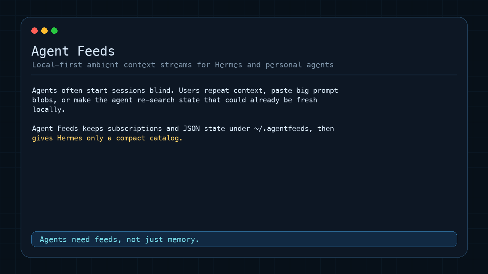

# Agent Feeds

Agent Feeds is a local-first ambient context layer for Hermes and personal agents.

Personal agents often start sessions blind: users repeat project context, paste large prompt blobs, or make the agent re-search/re-run commands for state that could already be cached locally. Agent Feeds fixes that with refreshable subscriptions, compact prompt metadata, and inspectable JSON state on disk.

**Agents need feeds, not just memory.** Memory is for durable facts. Feeds are for fresh, timestamped state: repo issues, project notes, RSS/news, calendars, weather, local dashboards, or approved local command output.

## Quick Demo



Install the standalone Hermes plugin:

```bash
git clone https://github.com/verkyyi/agentfeeds-hermes-plugin ~/.hermes/plugins-src/agentfeeds-hermes-plugin
~/.hermes/plugins-src/agentfeeds-hermes-plugin/install.sh
```

Restart Hermes, then try one prompt at a time:

```text
What Agent Feeds providers can I subscribe to?
```

```text
Subscribe me to Hacker News front page.
```

```text
Show me the current Hacker News front page from Agent Feeds.
```

```text
Subscribe my project notes at ~/notes/project.md as Project notes.
```

```text
Refresh Project notes and summarize it.
```

What happens under the hood:

- active subscriptions live in `~/.agentfeeds/subscriptions.yaml`
- Hermes sees only compact stream metadata from `~/.agentfeeds/catalog.md`
- detailed snapshots/events live in `~/.agentfeeds/state/*.json`
- when relevant, Hermes reads the right state file before using web search

Agent Feeds is not long-term memory. It is a refreshable, local-first context layer for fresh, inspectable ambient context that lives on your machine.

## Why It Exists

Personal agents need awareness of local and private state without stuffing every detail into the prompt, rerunning expensive discovery, or reaching for web search first.

Agent Feeds keeps the heavy data on disk:

- compact stream metadata is injected into Hermes
- detailed JSON state is read only when relevant
- background refresh keeps subscriptions warm
- providers can be public feeds, local files, or operator-approved local commands

This makes the agent context-aware while keeping the data path visible and debuggable.

Agent Feeds also gives Hermes a small local control surface for discovering providers, subscribing to sources, refreshing state, reading local snapshots/events, and reporting the result in conversation.

## What You Can Ask

Each example is meant to be used as a single message to Hermes:

```text
What Agent Feeds providers can I subscribe to?
```

```text
Subscribe my project notes at ~/notes/project.md as Project notes.
```

```text
Refresh Project notes and tell me what changed.
```

```text
Subscribe me to Hacker News front page.
```

```text
Subscribe me to OpenAI News from https://openai.com/news/rss.xml.
```

```text
Can Agent Feeds subscribe to my SQLite task database? If not, draft a provider.
```

Hermes should handle the details. You should not need to know provider IDs, subscription IDs, or CLI flags unless you explicitly ask for them.

## Install For Hermes

Use the standalone Hermes plugin repo:

```bash
git clone https://github.com/verkyyi/agentfeeds-hermes-plugin ~/.hermes/plugins-src/agentfeeds-hermes-plugin
~/.hermes/plugins-src/agentfeeds-hermes-plugin/install.sh
```

The installer:

- clones or updates Agent Feeds core under `~/.hermes/plugins-src/agentfeeds-core`
- clones or updates the built-in provider catalog under `~/.hermes/plugins-src/agentfeeds-catalog`
- symlinks the Hermes plugin to `~/.hermes/plugins/agentfeeds`
- symlinks the Hermes skill to `~/.hermes/skills/agentfeeds`
- installs Agent Feeds command wrappers in `~/.local/bin`
- enables the Hermes plugin
- initializes `~/.agentfeeds/catalog.md`

Restart Hermes after installation.

## How It Works

Agent Feeds stores its local state under `~/.agentfeeds/`:

- `subscriptions.yaml` is the source of truth for active subscriptions.
- `catalog.md` is the compact summary Hermes reads to find relevant state files.
- `state/` contains JSON snapshots for subscribed sources.

The Hermes plugin injects only compact stream metadata into the prompt:

```text
<agentfeeds>
Available local streams:
- local/project-notes-md: Project notes
- dev/hackernews-frontpage: Hacker News front page

When relevant, read ~/.agentfeeds/catalog.md to locate the state file before web search.
</agentfeeds>
```

Full data stays on disk and is read only when relevant.

## Demo Flow

After installing the Hermes plugin, ask Hermes one prompt at a time:

```text
What Agent Feeds providers can I subscribe to?
```

```text
Subscribe me to Hacker News front page.
```

```text
Show me the current Hacker News front page from Agent Feeds.
```

Or inspect the same flow directly:

```bash
agentfeeds discover hacker
agentfeeds subscribe dev/hackernews-frontpage
agentfeeds status
cat ~/.agentfeeds/catalog.md
```

For a private local source:

```text
Subscribe my project notes at ~/notes/project.md as Project notes.
```

```text
Refresh Project notes and summarize it.
```

## Built-In Providers

Built-in provider definitions live in the standalone catalog repo:

```text
https://github.com/verkyyi/agentfeeds-catalog
```

Current built-ins include:

- `local/file`: read-only snapshot of one local text, Markdown, or JSON file
- `news/rss-generic`: RSS or Atom feed
- `dev/hackernews-frontpage`: Hacker News front page
- `dev/github-releases`: GitHub repository releases
- `dev/github-issues`: GitHub repository issues
- `dev/github-prs`: GitHub repository pull requests
- `calendar/ics`: public iCalendar feed
- `weather/openmeteo-current`: current weather by latitude/longitude
- `weather/openmeteo-forecast`: 7-day forecast by latitude/longitude
- `finance/exchangerate`: current exchange rates
- `geo/usgs-earthquakes-hour`: recent USGS earthquakes
- `space/iss-location`: current ISS location

Catalog entries are providers/templates. Active subscriptions are concrete instances. For example, `news/rss-generic` can become `news/openai-com`, and `local/file` can become `local/project-notes-md`.

Catalog loading can be pointed at a local checkout or alternate raw source:

```bash
AGENTFEEDS_CATALOG_DIR=~/projects/agentfeeds-catalog agentfeeds-fetch --update-catalog
AGENTFEEDS_CATALOG_BASE_URL=https://raw.githubusercontent.com/verkyyi/agentfeeds-catalog/main agentfeeds-fetch --update-catalog
```

## Background Refresh

Install background polling when you want subscriptions to stay warm without waiting for Hermes to refresh them during a conversation:

```bash
agentfeeds-install-poll
```

Uninstall it with:

```bash
agentfeeds-uninstall-poll
```

On macOS this installs a LaunchAgent at `~/Library/LaunchAgents/dev.agentfeeds.fetch.plist`. On Linux it installs a tagged crontab block. The interval is the shortest configured subscription interval, floored at 5 minutes.

## Provider Authoring

If no built-in provider fits, ask Hermes to draft one:

```text
Can Agent Feeds subscribe to my local SQLite task database? If not, draft a provider.
```

Hermes should:

- check existing providers first
- draft provider YAML under `~/.agentfeeds/providers/streams/`
- draft or reuse a schema under `~/.agentfeeds/providers/schemas/event-types/`
- validate the provider with `agentfeeds providers validate`
- test it once with `agentfeeds providers test <provider-id> key=value`
- smoke-test it with a temporary Agent Feeds root before touching your live subscriptions

Command-based providers are supported through `local_command`, but Hermes should only create them for commands you explicitly approve. They run without a shell, with timeout and output limits. They can capture one command snapshot or parse JSON output into event items.

For personal agents, prefer local/private read-only providers before adding public feeds.

## Manual Inspection

You can inspect Agent Feeds directly when needed:

```bash
agentfeeds list
agentfeeds status
agentfeeds discover local
agentfeeds providers adapters
agentfeeds providers list
agentfeeds providers path
agentfeeds providers scaffold json_http personal/tasks
agentfeeds providers test personal/tasks url=https://example.com/tasks.json
agentfeeds providers validate
```

These commands are mainly for debugging. The normal UX is to ask Hermes for the outcome you want.

## FAQ

### Why not just use agent memory?

Memory is for durable facts that should survive across sessions. Agent Feeds is for fresh state that changes over time: feed items, repo issues, calendars, weather, dashboards, project notes, or command snapshots. The state is timestamped and refreshable instead of being mixed into chat history.

### Why not put everything in the prompt?

Large prompts are expensive, noisy, and stale. Agent Feeds injects only a compact catalog of available streams, then lets Hermes read detailed state only when the user asks something relevant.

### Why not a vector database?

Agent Feeds is not semantic recall. It is structured, inspectable current state. Subscriptions, provider definitions, schemas, and JSON state are plain files under `~/.agentfeeds/` so operators can debug what the agent sees.

### Why not MCP?

MCP is a great tool interface. Agent Feeds is a local state substrate: background refresh, subscriptions, a compact catalog, and state files that agents can inspect across sessions. They can complement each other.

### Is this an RSS reader?

RSS is one provider type. Agent Feeds also supports local files, GitHub releases/issues/PRs, ICS calendars, weather, exchange rates, and operator-approved local commands. The product is the subscription/state layer for agents, not a human feed UI.

## Sharing

See [docs/DEMO.md](docs/DEMO.md) for the demo transcript and talking points.

See [docs/SHARING.md](docs/SHARING.md) for a short pitch, demo script, and release notes draft.

For product framing, use cases, and benefits, see [docs/PRODUCT_SPEC.md](docs/PRODUCT_SPEC.md).

For protocol and implementation details, see [docs/SPEC.md](docs/SPEC.md).
