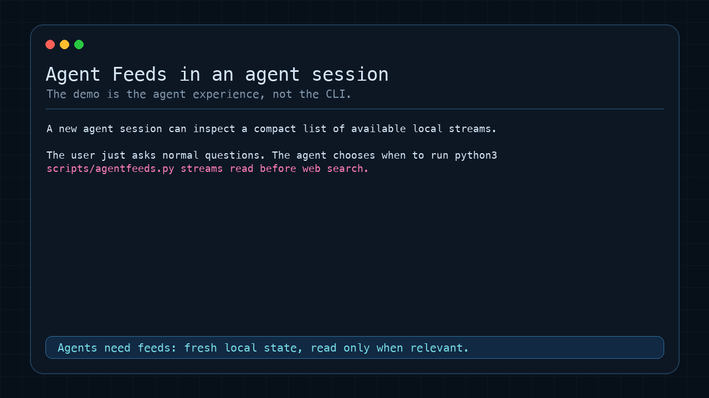

# Agent Feeds Skill

Agent Feeds is an Agent Skill that gives compatible agents a local-first ambient context layer: discover feed templates, subscribe to sources, keep them refreshed in the background, and answer from compact local stream state instead of making the user repeat context or rerunning the same data pipeline.

The primary audience for this repository is agent operators who want to install, publish, or audit the skill bundle. The Python package and CLI are implementation details for the agent to drive.

**Agents need feeds, not just memory.** Memory is for durable facts. Feeds are for fresh, incoming, timestamped state: project notes, RSS/news, GitHub issues and releases, calendars, weather, local dashboards, personal sources, or operator-approved command output.

## Mac Personal Agent Quick Start

For a Mac operator running a local personal agent such as Hermes or OpenClaw, the first useful setup is:

```bash
python3 scripts/setup.py
python3 scripts/agentfeeds.py admin polling install
python3 scripts/agentfeeds.py admin macos install-templates
```

Approve only the local app sources you want the agent to read:

```bash
python3 scripts/agentfeeds.py admin templates approve-command macos/calendar-today
python3 scripts/agentfeeds.py admin templates approve-command macos/reminders-open
python3 scripts/agentfeeds.py admin templates approve-command macos/mail-inbox-recent
```

Subscribe the approved sources:

```bash
python3 scripts/agentfeeds.py subscribe macos/calendar-today --title "Calendar today"
python3 scripts/agentfeeds.py subscribe macos/reminders-open --title "Open reminders"
python3 scripts/agentfeeds.py subscribe macos/mail-inbox-recent --title "Recent inbox mail"
python3 scripts/agentfeeds.py streams health
```

macOS may ask for Automation or app-data permissions the first time the streams refresh. After that, background polling keeps the local state warm so your agent can answer questions like:

```text
What is on my calendar today?
```

```text
What reminders are still open?
```

```text
Anything recent in my inbox I should notice?
```

## Quick Demo



After installing the skill, ask your agent:

```text
What Agent Feeds templates can I subscribe to?
```

```text
Subscribe me to Hacker News front page.
```

```text
Show me the current Hacker News front page from Agent Feeds.
```

```text
Subscribe my project notes at ~/notes/project.md as Project notes.
```

```text
Refresh Project notes and summarize it.
```

The agent should handle template discovery, subscription setup, refreshes, and compact state reads through the bundled scripts. You should not need to know template IDs, subscription IDs, or CLI flags unless you ask for them.

## Install The Skill

Download the latest skill bundle from the bundle release and unpack it into your agent's skills directory:

```text
https://github.com/verkyyi/agentfeeds/releases/tag/skill-v0.1.1
```

The release asset is:

```text
agentfeeds-skill-v0.1.1.zip
```

The unpacked skill folder contains:

- `SKILL.md`: agent-facing instructions
- `agents/openai.yaml`: skill list metadata for compatible UIs
- `scripts/`: deterministic CLI entry points the agent can run
- `scripts/lib/agentfeeds_runtime/`: bundled Python runtime package
- `catalog/`: frozen built-in template catalog fallback
- `references/`: setup, template authoring, background refresh, and publishing notes loaded only when needed
- `assets/`: demo and skill assets

From the skill root, run setup once:

```bash
python3 scripts/setup.py
```

This installs the bundled runtime into `~/.agentfeeds/runtime-venv/`. The script entry points automatically re-exec through that environment after setup:

```bash
python3 scripts/agentfeeds.py --help
python3 scripts/agentfeeds_fetch.py --help
```

Background refresh is required for normal ambient use:

```bash
python3 scripts/agentfeeds.py admin polling status
python3 scripts/agentfeeds.py admin polling install
python3 scripts/agentfeeds.py streams health
```

Agents should also generate the compact session brief and place it into the most stable prompt/context slot their host provides, preferably a system-level slot:

```bash
python3 scripts/agentfeeds.py brief
```

The default brief is intentionally compact and stable for prompt caching. It lists active stream IDs and titles without volatile timestamps.

## What The Skill Enables

Agent Feeds gives the agent a small local control surface:

- `python3 scripts/agentfeeds.py templates find/show ...` discovers reusable feed definitions
- `python3 scripts/agentfeeds.py subscribe ...` creates active subscriptions
- `python3 scripts/agentfeeds.py streams ...` lists, finds, and reads refreshed data
- `python3 scripts/agentfeeds.py search ...` searches refreshed local state and returns matching snippets
- `python3 scripts/agentfeeds.py streams health ...` reports missing, stale, and failing streams
- `python3 scripts/agentfeeds.py refresh ...` refreshes subscriptions
- `python3 scripts/agentfeeds.py admin polling ...` keeps subscriptions warm in the background
- `python3 scripts/agentfeeds.py admin macos install-templates` installs pending local templates for Calendar, Reminders, and Mail
- `python3 scripts/agentfeeds.py brief` emits compact stable context for session-start prompt insertion

Runtime state lives under `~/.agentfeeds/`, but agents should normally use the CLI instead of reading or writing storage files directly. The file layout remains inspectable for debugging and local template authoring.

## Core Vocabulary

- Template: reusable feed definition. Some templates are ready to subscribe with no parameters; others require parameters.
- Subscription: configured active instance of a template.
- Stream: readable refreshed data for an active subscription.

For example, `news/rss-generic` is a template, `news/openai-com` can be a subscription, and the refreshed RSS items are the stream data.

## Operator Workflows

Ask your agent for outcomes in natural language:

```text
What Agent Feeds templates can I subscribe to?
```

```text
Subscribe me to OpenAI News from https://openai.com/news/rss.xml.
```

```text
Refresh OpenAI News and tell me what changed.
```

```text
Can Agent Feeds subscribe to my SQLite task database? If not, draft a template.
```

The skill instructs the agent to:

- search existing templates first
- collect only required template parameters
- subscribe through the CLI
- refresh before summarizing when freshness matters
- search local stream state before rerunning external searches or source-specific queries
- read compact stream data only when relevant
- draft and test local templates when no built-in template fits

For `local_command` templates, the agent should only create commands you explicitly approve. Command templates run without a shell, with timeout and output limits, and they will not execute until you approve the exact template and command digest with `admin templates approve-command` in an interactive terminal.

## Built-In Templates

Built-in template definitions live in the standalone catalog repository:

```text
https://github.com/verkyyi/agentfeeds-catalog
```

Release bundles include a frozen catalog snapshot so first-run template discovery works without reaching GitHub. Updating the catalog can still pull from the standalone catalog repo or an alternate source.

Current built-in templates include:

- `local/file`: read-only snapshot of one local text, Markdown, or JSON file
- `news/rss-generic`: RSS or Atom feed
- `dev/hackernews-frontpage`: Hacker News front page
- `dev/github-releases`: GitHub repository releases
- `dev/github-issues`: GitHub repository issues
- `dev/github-prs`: GitHub repository pull requests
- `calendar/ics`: public iCalendar feed
- `weather/openmeteo-current`: current weather by latitude/longitude
- `weather/openmeteo-forecast`: 7-day forecast by latitude/longitude
- `finance/exchangerate`: current exchange rates
- `geo/usgs-earthquakes-hour`: recent USGS earthquakes
- `space/iss-location`: current ISS location

macOS-local personal templates are installed separately because they use operator-approved local commands and app permissions:

```bash
python3 scripts/agentfeeds.py admin macos install-templates
```

This writes pending templates for Calendar, Reminders, and Mail. Approve only the templates you want enabled with:

```bash
python3 scripts/agentfeeds.py admin templates approve-command <template-id>
```

Catalog loading can be pointed at a local checkout or alternate raw source:

```bash
AGENTFEEDS_CATALOG_DIR=~/projects/agentfeeds-catalog python3 scripts/agentfeeds_fetch.py --update-catalog
AGENTFEEDS_CATALOG_BASE_URL=https://raw.githubusercontent.com/verkyyi/agentfeeds-catalog/main python3 scripts/agentfeeds_fetch.py --update-catalog
```

## Background Refresh

Install background polling so subscriptions stay warm without waiting for the agent to refresh them during a conversation:

```bash
python3 scripts/agentfeeds.py admin polling install
```

Check it with:

```bash
python3 scripts/agentfeeds.py admin polling status
python3 scripts/agentfeeds.py streams health
```

Uninstall it only when you no longer want ambient refresh:

```bash
python3 scripts/agentfeeds.py admin polling uninstall
```

On macOS this installs a LaunchAgent at `~/Library/LaunchAgents/dev.agentfeeds.fetch.plist`. On Linux it installs a tagged crontab block. The interval is the shortest configured subscription interval, floored at 5 minutes.

## Host-Specific Bundles

The canonical skill bundle works in any compatible agent that can load `SKILL.md` and run the bundled scripts. Host-specific bundles add only install ergonomics and host glue, such as session-start hooks or prompt-slot wiring.

Hermes users can install the standalone Hermes plugin:

```bash
git clone https://github.com/verkyyi/agentfeeds-hermes-plugin ~/.hermes/plugins-src/agentfeeds-hermes-plugin
~/.hermes/plugins-src/agentfeeds-hermes-plugin/install.sh
```

The Hermes plugin vendors or links this canonical skill unmodified, installs command wrappers, enables the plugin, initializes `~/.agentfeeds/`, and wires compact stream metadata into Hermes turns.

Restart Hermes after installation.

## Publishing

This repo is the source tree for the skill. Release artifacts should be built as portable skill bundles:

```bash
python3 scripts/bundle/build_skill_bundle.py --output dist/agentfeeds-skill-v0.1.1.zip
```

The bundle intentionally includes only the skill surface, frozen catalog snapshot, and runtime files needed by agents. Repo-only docs, tests, build outputs, and caches are excluded.

## Distribution Model

Agent Feeds ships as one canonical skill with optional host-specific shells around it.

- The canonical skill bundle is the source of truth: `SKILL.md`, `agents/`, `references/`, `scripts/`, `assets/`, `catalog/`, `LICENSE`, and `pyproject.toml`.
- Host-specific bundles may vendor the canonical skill unmodified and add only host glue: manifests, hooks, installers, command wrappers, prompt-slot wiring, or one-click package formats.
- Runtime setup is shared under `~/.agentfeeds/runtime-venv/`; whichever bundle installs first creates it, and later bundles reuse it.

If a behavior is useful in every agent, keep it in this repo's `SKILL.md` or references. If it is meaningful only for one host, keep it in that host's adapter bundle. Do not fork `SKILL.md` per host; fix the canonical skill abstraction instead.

## FAQ

### Why not just use agent memory?

Memory is for durable facts that should survive across sessions. Agent Feeds is for fresh state that changes over time: feed items, repo issues, calendars, weather, dashboards, project notes, or command snapshots. The state is timestamped and refreshable instead of being mixed into chat history.

### Why not put everything in the prompt?

Large prompts are expensive, noisy, and stale. Agent Feeds lets the agent discover available streams, then read detailed state only when the user asks something relevant.

### Why not a vector database?

Agent Feeds is not semantic recall. It is structured, inspectable current state. Subscriptions, template definitions, schemas, and JSON state are plain files under `~/.agentfeeds/` so operators can debug what the agent sees.

### Why not MCP?

MCP is a tool interface. Agent Feeds is a local state substrate: background refresh, subscriptions, a compact catalog, and state files that agents can inspect across sessions. They can complement each other.

### Is this an RSS reader?

RSS is one template type. Agent Feeds also supports local files, GitHub releases/issues/PRs, ICS calendars, weather, exchange rates, and operator-approved local commands. The product is the subscription/state layer for agents, not a human feed UI.

## More Docs

See [docs/DEMO.md](docs/DEMO.md) for the demo transcript and talking points.

See [docs/SHARING.md](docs/SHARING.md) for a short pitch, demo script, and release notes draft.

For product framing, use cases, and benefits, see [docs/PRODUCT_SPEC.md](docs/PRODUCT_SPEC.md).

For protocol and implementation details, see [docs/SPEC.md](docs/SPEC.md).
